# Database Entity Relationship Diagram (ERD)

## Tables and Relationships

```mermaid
erDiagram
    %% Core User Management
    users {
        uuid id PK
        varchar full_name
        text email UK
        text password
        text branch
        role role_enum
        date last_activity_date
        timestamp created_at
    }



    %% Appointment System
    appointments {
        uuid id PK
        text email UK
        varchar full_name
        varchar mobile_number
        date appointment_date
        varchar appointment_time
        varchar branch
        varchar barber
        text services
        timestamp created_at
    }

    %% Inventory Management
    inventory_items {
        text id PK
        text name
        text sku UK
        text category
        integer quantity
        integer reorder_threshold
        decimal unit_price
        text supplier
        timestamp expiration_date
        text status
        text branch
        timestamp created_at
        timestamp updated_at
    }

    stock_transactions {
        text id PK
        text item_id FK
        text type
        integer quantity
        integer previous_quantity
        integer new_quantity
        uuid user_id FK
        text notes
        text reason
        text branch
        timestamp created_at
    }

    purchase_orders {
        text id PK
        text order_number UK
        text supplier
        text status
        decimal total_amount
        uuid requested_by FK
        timestamp requested_date
        timestamp ordered_date
        timestamp received_date
        text notes
        text branch
        timestamp created_at
        timestamp updated_at
    }

    purchase_order_items {
        text id PK
        text order_id FK
        text item_id FK
        text item_name
        integer quantity
        decimal unit_price
        decimal total_price
        timestamp created_at
    }

    suppliers {
        text id PK
        text name
        text contact_person
        text email
        text phone
        text address
        timestamp created_at
        timestamp updated_at
    }

    inventory_categories {
        text id PK
        text name UK
        text description
        timestamp created_at
    }

    inventory_branches {
        text id PK
        text name UK
        text address
        text phone
        text hours
        text manager_id
        timestamp created_at
    }

    item_requests {
        text id PK
        text request_number UK
        text status
        text items
        decimal total_amount
        text requested_by
        timestamp requested_date
        text reviewed_by
        timestamp reviewed_date
        text notes
        text rejection_reason
        text branch
        timestamp created_at
        timestamp updated_at
    }

    %% Staff Management
    barbers {
        text id PK
        text name
        text specialties
        text experience
        decimal rating
        text image
        text branches
        timestamp created_at
    }

    services_catalog {
        text id PK
        text category
        text title
        text description
        decimal price
        timestamp created_at
    }

    staff_shifts {
        uuid id PK
        text barber_id
        text branch_id
        date date
        varchar start_time
        varchar end_time
        text breaks
        shift_type type
        timestamp created_at
        timestamp updated_at
    }

    staff_leaves {
        uuid id PK
        text barber_id
        leave_type type
        date date
        varchar start_time
        varchar end_time
        leave_status status
        text reason
        timestamp created_at
        timestamp updated_at
    }

    shift_templates {
        uuid id PK
        varchar name
        varchar start_time
        varchar end_time
        varchar break_start
        varchar break_end
        timestamp created_at
        timestamp updated_at
    }

    %% Transaction Verification
    transaction_verifications {
        uuid id PK
        text transaction_id
        verification_status status
        text verified_by
        timestamp verified_at
        text rejection_reason
        timestamp created_at
        timestamp updated_at
    }

    %% Relationships
    users ||--o{ stock_transactions : "performs"
    inventory_items ||--o{ stock_transactions : "tracked_in"
    
    users ||--o{ purchase_orders : "requests"
    purchase_orders ||--o{ purchase_order_items : "contains"
    inventory_items ||--o{ purchase_order_items : "ordered_as"
    

```

## Key Relationships

### Inventory Management
- **users** ↔ **stock_transactions**: Users perform stock transactions
- **inventory_items** ↔ **stock_transactions**: Items have transaction history
- **users** ↔ **purchase_orders**: Users can request purchase orders
- **purchase_orders** ↔ **purchase_order_items**: Orders contain multiple items
- **inventory_items** ↔ **purchase_order_items**: Items can be ordered

### Staff & Scheduling
- **barbers** are referenced by **staff_shifts** and **staff_leaves** (text references)
- **inventory_branches** are referenced by various tables via branch fields

### Transaction Verification
- **transaction_verifications** references external sales transactions via transaction_id

## Enums Used
- `role`: USER, ADMIN, MANAGER, STAFF

- `shift_type`: full, half, split
- `leave_type`: vacation, sick, unpaid, other
- `leave_status`: pending, approved, denied

- `verification_status`: pending, verified, rejected

## Notes
- Many relationships use text-based foreign keys rather than proper UUID references
- Branch filtering is implemented across multiple tables
- The system supports multi-branch operations
- Transaction verification system is separate from the main sales system